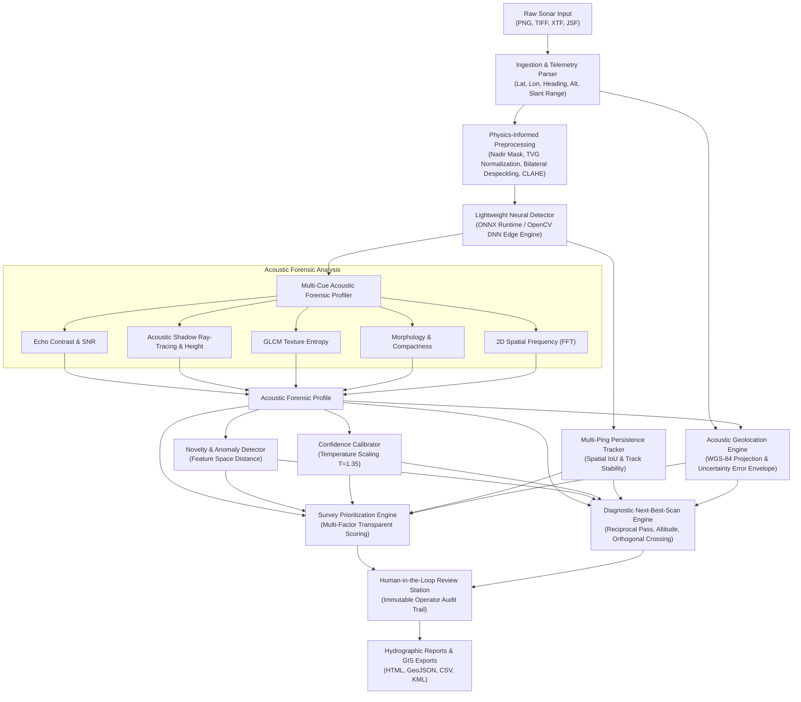

# AQUAFORGE System Architecture & Perception Engine

AQUAFORGE is built as a serious, functioning prototype that matches the operational workflow of professional marine hydrographic survey and anomaly detection products.

---

## 1. Subsystem Architecture

### A. Format Ingestion & Telemetry Parser (`backend/ingestion/`)
- **Image Ingestion (`image.py`):** Ingests 8-bit and 16-bit GeoTIFF, PNG, and JPEG waterfall strips. Parses sidecar JSON telemetry files.
- **XTF Parser (`xtf.py`):** Low-level binary header scanner for eXtended Triton Format (magic `0xFACE`). Extracts ping headers, channels, slant range, and towfish attitude.
- **JSF Parser (`jsf.py`):** Parser for EdgeTech acoustic stream packets (magic `0x1601`).
- **Security:** Rejects path traversals, validates image dimensions ($< 8192\text{px}$), and safely decodes files without arbitrary code execution.

### B. Physics-Based Preprocessing (`backend/sonar/preprocessing.py`)
- **Time-Varying Gain (TVG) Normalization:** Compensates for spherical spreading loss ($20 \log R$) and water column attenuation ($\alpha R$). Smoothes cross-track range intensity profiles.
- **Speckle Suppression:** Bilateral filtering preserving sharp acoustic highlight-to-shadow boundaries while smoothing Rayleigh speckle.
- **Slant-Range Correction:** Remaps slant range $R_s$ to true horizontal ground range $R_g = \sqrt{\max(0, R_s^2 - h^2)}$ given sensor altitude $h$.
- **CLAHE:** Contrast-Limited Adaptive Histogram Equalization with 4 operational presets: `STANDARD`, `HIGH-CONTRAST`, `LOW-SNR`, `CONSERVATIVE`.

### C. Primary Detection & ONNX Runtime (`backend/models/`)
- **Interchangeable Adapter Pattern:** Extends `BaseSonarDetector` so models can be swapped without modifying downstream pipelines.
- **ONNX CPU Deployment:** Executes directly on CPU via OpenCV DNN / ONNX Runtime with sub-30ms latency per tile.
- **Acoustic Saliency Fusion:** Detects coupled highlight-shadow pairs and runs non-maximum suppression (NMS) to eliminate duplicate candidate boxes.

### D. Multi-Cue Acoustic Forensic Profiler (`backend/acoustics/`)
- Computes normalized acoustic profile across 5 physical dimensions:
  1. **Intensity:** Echo contrast ratio, highlight strength (`LOW` to `VERY HIGH`), target-to-background SNR.
  2. **Shadow:** Shadow area, shadow length, shadow-to-highlight ratio, target relief height $H_{target} = \frac{L_{shadow} \cdot h_{sensor}}{R_{slant} + L_{shadow}}$.
  3. **Texture:** GLCM contrast, homogeneity, energy, Shannon entropy ($-\sum p \log_2 p$).
  4. **Geometry:** Aspect ratio, compactness ($4\pi A / P^2$), convexity, elongation.
  5. **Frequency:** 2D spatial FFT power spectrum detecting periodic mesh structures (e.g. fishing nets).

### E. Temporal Persistence Tracker (`backend/tracking/persistence.py`)
- Groups contacts across sequential waterfall pings based on spatial proximity and acoustic similarity.
- Classifies contacts as `PERSISTENT CONTACT` (3+ observations, spatial track length) vs `SINGLE-PING CONTACT` (transient return).

### F. Geolocation & Uncertainty Engine (`backend/geospatial/geolocation.py`)
- Performs spherical direct geodetic projection from vessel GNSS, heading, towfish layback, altitude, and slant range into WGS-84.
- Accounts for GPS error ($\sigma_{GPS}$), heading gyro drift ($\sigma_{heading} \cdot R_g$), and grazing angle altitude variance to report deterministic uncertainty bounds ($\pm \epsilon\text{ m}$).

### G. Transparent Prioritization Engine (`backend/priority/prioritizer.py`)
- Evaluates 4 weighted criteria: Acoustic Saliency (0.25), Multi-Ping Persistence (0.25), Navigational Hazard Criticality (0.25), and Novelty Verification (0.25).
- Ranks into `HIGH`, `MEDIUM`, `LOW`, or `REVIEW` with plain-English justification.

### H. Next-Best-Scan Recommendation Engine (`backend/recommendation/engine.py`)
- Formulates actionable hydrographic instructions for subsequent survey passes:
  - Weak shadow $\rightarrow$ *Reciprocal pass (180° offset)*
  - High novelty anomaly $\rightarrow$ *High-frequency (800 kHz) close-range inspection*
  - Single-ping return $\rightarrow$ *Overlapping pass (30% swath overlap)*
  - Elongated conduit $\rightarrow$ *Orthogonal crossing line (90° to target axis)*

### I. Human-in-the-Loop Review Station (`backend/review/review_manager.py`)
- Operator decisions: `ACCEPT`, `RECLASSIFY`, `FALSE_POSITIVE`, `UNKNOWN`, `FOLLOW_UP_REQUIRED`.
- Immutably logs reviewer name, timestamp, and audit rationale without overwriting raw neural detection provenance.
